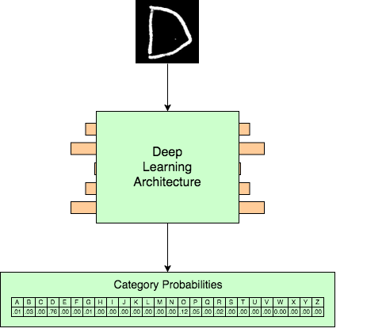

# Taint
by Andy Chen


## Introduction

This is an exploratory project primarily inspired by two ideas:
* Current deep learning models are, in a sense, fragile. Imagine a trained 
image classifier on animals (it can figure out what animal is in a given 
picture), with excellent performance on a test set. If we take a correctly 
identified image of a lion and tweak the pixels in a strategic way (so that 
to a human, the image looks roughly the same), the classifier might actually 
think that the new image has an owl instead! These tweaked pictures are called 
_adversarial examples_, and they demonstrate how unstable certain machine 
learning models can be.



* Human-created concepts are also fragile; the boundary between opposing 
concepts such as "good" and "evil" is a fine one. For instance, imagine 
we saw Bryce offer to pay for Clay's beer in a convenience store; at first
glance, we may see this deed as a generous one. However, if we notice in 
Clay's voice that he is actually somewhat reluctant to buy that beer, then
we might wonder if Bryce is forcing Clay to buy it, changing our perception
of the situation. In this example, certain nuances completely change the 
way we perceive, or _classify_, the scenario in our heads. However, an AI
may not be able to pick up on these nuances, which may cause conflicts between
AI and people.

This project represents how machines may not have the same understanding of 
concepts such as "good" and "evil" as us; small changes to a situation that 
don't affect our big picture understanding may completely change the machine's 
understanding of the situation.

This project is devoted to finding adversarial examples for images of 
handwritten letters of the alphabet. Suppose we have an accurate classifier 
of those letters. If we have correctly identified images of the letters "G", 
"O", "O", and "D", then we can find adversarial examples that the model 
classifies as "E", "V", "I", and "L". This process is an example of a 
_targeted attack_ on the classifier; we're trying to fool the classifier into 
thinking that our image is the letter G (rather than just trying to make the 
classifier wrong in general). 


For simplicity, we use a white-box attack, meaning that we can see the 
mechanics of the classifier when creating adversarial examples. (In a real 
world setting, we would probably use a black-box attack, which means we can't
see how the classifier is making its predictions.)

{TODO: finish this description to talk about gradient descent}


## Requirements
* Python 3.6 (currently, Tensorflow does not support later versions of Python)
* Pip


## How to Use
First, install the required Python 3 libraries with pip:
```
pip install -r requirements.txt
```
Then, download the EMNIST letters dataset; visit the Kaggle dataset page and
download the `emnist-letters-train.csv` and `emnist-letters-test.csv` files.
Place them into the repository root directory.

Now, from the repository root directory, run the following command:
```
python src/train_classifier.py emnist-letters-train.csv emnist-letters-test.csv
```
This will train an alphabet classifier model, which we will attempt to "fool"
with adversarial examples. Start with an image of a letter of the alphabet,
such as the following:


(This image will be converted to grayscale and scaled to a 28x28 square.) Then,
run the following command.
```
python src/image_modify.py <path to original image> -t <target letter> 
```
This will produce an image in `bin/` that looks similar to the original image,
but is identified as the target letter when fed into the letter classifier.

NOTE: for either `train_classifier.py` or `image_modify.py`, you can run the 
command with the `-h` or `--help` flag to see all the possible flags and read 
what each argument means.


# TODO
* make diagrams for classification
